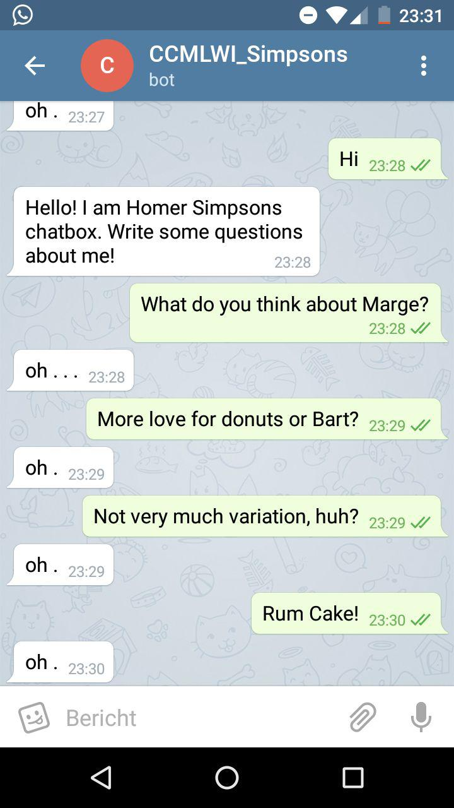

# Homer Simpson Chatbot

We created a chatbot that tries to mimic the famous Homer Simpson's way of speaking and personality. When a message is send to the Homer chatbot, it responds with generated sentences based on script lines of the Simpsons and the context of the sent message.

## Data
There has been made use of two datasets to enhance the dictionary of the embeddings that are used. The first, and most important, is "The Simpsons by the Data" dataset, that can be found on Kaggle (https://www.kaggle.com/wcukierski/the-simpsons-by-the-data). This dataset consists of all locations, episodes, characters and the script lines.

Because the previous dataset does not contain enough data, we first train our model on a bigger dataset based on movie dialogs. This second dataset is the "Cornell Movie-Dialogs Corpus", which can be found here: https://www.cs.cornell.edu/~cristian/Cornell_Movie-Dialogs_Corpus.html. This dataset consists of 300K utterances of different movies.

### Preprocessing
To train the model on both datasets the data needs to preprocessed, so that the model trains in the same fashion on both datasets.

The preprocessing that we chose are the following:
- Lowercase all characters
- Use a whitelist to filter all the unwanted characters. (whitelist: "0123456789abcdefghijklmnopqrstuvwxyz .?!")
- Cap the number of words in a sentence to 20.

Both datasets that we used had only spoken lines, so there was no need to do special preprocessing steps to remove onomatopoeias or non spoken actions. However, "The Simpsons by the Data" did contain some empty lines that had to be removed.

The data needs to be converted in the following format:

**Question** | **Answer**
---|---
| 

In our datasets, the "question" will be the input to our model, so it does not need to be a question per se. In our datasets, the question refers to the spoken line that precedes the answer, or output line.
All utterances of the Cornell dataset that fultill the requesites are used for training. The Simpson dataset is filtered on sentences that Homer speaks and these account for the answers. The sentence that precedes the sentence of homer is the question for the sentence pair.

## Training procedure
We first trained on the whole Cornell Movie-Dialogs Corpus for 15,000 epochs of size 32, which totalled in a size of 157000 question-answer pairs that are trained on. We then trained on 5,000 epochs of size 32, which is in total about 15,000 sentence pairs of Homer Simpson.

## Model
We wanted to implement a model that has some semantic knowledge. Thus, the model that we used to generate the sentences is a seq2seq model. First, the input sentence (Question) get enconded using a neural network and then a second neural network produces tokens that will be interpreted as the answer. This therefore generates sentences on the fly. For implementing the seq2seq model, we followed the tutorial that can be found on http://suriyadeepan.github.io/2016-12-31-practical-seq2seq/. 

### Problems
We found specially hard to train the seq2seq model. We came accross problems with the overfitting of the network that we were not able to deal with. 

### Future work
An interesting approach will be to implement Homer's personality explicitly, rather than expecting the seq2seq model to memorize Homer's information when trained for a second time. An interesting idea would be to implement the "Speaker model" analysed in "A Persona-Based Neural Conversation Model" by Li, Jiwei, et al. (https://arxiv.org/abs/1603.06155), although due to the lack of time and computational power it has not been done for this practice.

### Requirements:
- Python 3
- Tensorflow 0.12
- NLTK

Information about installing Tensorflow 0.12 can be found here:
https://www.tensorflow.org/versions/r0.12/get_started/os_setup

### Training the Chatbot
1. Clone this repository.
2. `cd` into the directory of the chatbot.
2. Download the Simpsons Dataset https://www.kaggle.com/wcukierski/the-simpsons-by-the-data and the Cornell Movie-Dialogs Corpus https://www.cs.cornell.edu/~cristian/Cornell_Movie-Dialogs_Corpus.html
3. Extract the archives and place `simpsons_script_lines.csv`, `movie_conversations.txt` and `movie_lines.txt` in `./data`
4. Run `python ./train.py`

### Running the Chatbot
1. Train the model as described in the previous section
2. Run `python ./telegram.py`
3. Add bot http://t.me/RUSimpsonBot to telegram and send a message to Homer.

## Screenshot Conversation
Unfortunately the combination of training on the datasets did not have an outcome as expected. It somehow overtrained on the word "oh" and dots. So on every text that needs to be processed, it responds the same.

